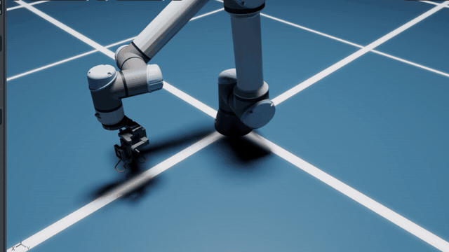
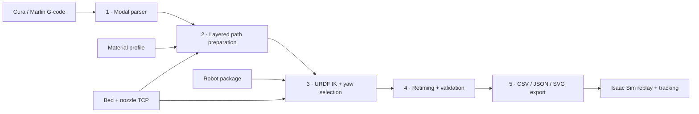

<div align="center">

# Robotic Printing Platform

### From slicer output to robot-aware additive-manufacturing trajectories

[](https://github.com/ZehaoDang1127/Robot-Arm-3D-Printing/actions/workflows/tests.yml)


Convert Cura/Marlin G-code into material-aware Cartesian waypoints, solve a
robot-specific joint trajectory, validate it, and export a repository-backed
replay bundle for NVIDIA Isaac Sim.

</div>

---

## Highlights

- **End-to-end planning** — parse G-code, prepare the print path, solve URDF-based inverse kinematics, retime the trajectory, validate it, and export simulation artifacts from one CLI.
- **Slicer-faithful extrusion** — preserve each move's raw `E` state and extrusion delta while converting deposited filament into material volume and optional mass.
- **Robot-agnostic core** — use the included Franka Panda, UR5, and UR5e packages or add another serial manipulator through a URDF and a JSON configuration.
- **Redundancy-aware IK** — sample nozzle yaw and select solutions greedily or with a global dynamic-programming pass designed to reduce motion and discontinuities along print runs.
- **Built-in validation** — report IK residuals, joint-limit margin, velocity and acceleration violations, Jacobian quality, estimated print time, and lightweight collision warnings.
- **Simulation-ready output** — generate CSV/JSON trajectories, SVG diagnostics, an Isaac Sim replay, per-step measured-TCP bead deposition, and desired-versus-actual joint-tracking logs.

## UR5e mounted-extruder replay showcase

<div align="center">
  <a href="./Robotic_3D%20Printing_demo.mp4">
    
  </a>
  <br>
  <sub><a href="./Robotic_3D%20Printing_demo.mp4">Watch the full 77-second replay</a></sub>
</div>

The recording demonstrates the complete, uncapped first-layer replay generated
by the [UR5e command below](#4-generate-the-ur5e-mounted-extruder-replay), not
the coarse smoke-test configuration:

| Replay setting | Recorded configuration |
| --- | --- |
| Input and layer range | `strong_universal_wall_hook_vcd.gcode`, `--lo 0 --hi 1` (the complete first parsed layer) |
| Robot and tool asset | `--robot ur5e` with `--isaac-usd UR5e_extruder.usd`, including the repository-local mounted-extruder payload and UR5e nozzle TCP |
| Path preparation | `--max-seg-len-mm 2` and `--simplify-deg 0` |
| IK selection and coverage | `--ik-selection-mode greedy`, full waypoint coverage, and no `--max-ik-waypoints` cap |
| Replay output | Retimed position-target playback in Isaac Sim with orange visual bead deposition for printing moves |

## What is the Robotic Printing Platform?

Conventional slicers describe how a Cartesian 3D printer should move; they do
not account for the kinematics, redundancy, limits, singularities, or geometry
of a multi-axis robot arm. This project bridges that gap. It treats the G-code
as the manufacturing intent, preserves its layer, feedrate, travel, retraction,
and extrusion semantics, then translates the selected print layers into a
robot-base-frame trajectory suitable for analysis and simulation.

The repository is organized as a set of replaceable stages rather than a
single robot-specific script. The G-code parser, material model, path planner,
robot solver, trajectory retimer, validation tools, and simulator exporter
have explicit boundaries, making the platform useful both as a working UR5e
printing pipeline and as a foundation for research on robot-aware additive
manufacturing.

> [!IMPORTANT]
> This is a planning and simulation toolchain. It does not command physical
> hardware. Before a real print, independently calibrate the robot model, base
> and bed frames, nozzle TCP, payload, collision geometry, process timing, and
> safety system in the production control stack.

## Pipeline at a glance



| Stage | What it does | Key result |
| --- | --- | --- |
| Parse | Resolves modal motion and extrusion state from `G0`/`G1`, `G20`/`G21`, `G90`/`G91`, `M82`/`M83`, `G92`, and Cura layer comments. | Absolute printer-frame moves with per-move `de`, feedrate, layer, print/travel state, and bounds. |
| Prepare | Groups contiguous print and travel runs, simplifies collinear print vertices, densifies long segments, conserves extrusion, and places the part on the configured bed. | Material-aware Cartesian waypoints in metres with a downward planar nozzle axis. |
| Solve | Loads a serial chain from URDF, runs damped least-squares IK over candidate nozzle yaws, and applies greedy or global selection. | Joint positions, residuals, IK iterations, and Jacobian metrics for each waypoint. |
| Retime | Starts from the G-code feedrate and increases segment duration as needed to satisfy configured joint velocity and acceleration limits. | A timestamped trajectory that starts and ends at zero joint velocity. |
| Validate and export | Evaluates trajectory quality and writes simulator/runtime artifacts. | Machine-readable reports, plots, trajectory files, and an Isaac Sim replay script. |

## Supported robot packages

All bundled robots use the same `URDFRobotPlanner`; their geometry, joint
metadata, limits, home pose, simulator asset, TCP, and IK overrides live in
their own configuration folders.

| CLI name | Model | DoF | Notes |
| --- | --- | ---: | --- |
| `panda` | Franka Emika Panda | 7 | Default package; bundled URDF and 855 mm configured reach. |
| `ur5` | Universal Robots UR5 | 6 | Bundled URDF, UR-style joint chain, and Isaac Sim UR5 asset path. |
| `ur5e` | Universal Robots UR5e + extruder | 6 | NVIDIA/UR-aligned geometry, custom mounted-extruder USD, CAD-derived nozzle TCP, and a 2 mm position tolerance override. |
| `both` | Panda + UR5 | — | Runs the same prepared path for both packages and separates their outputs. |
| `config` | User-selected package | — | Uses `robot.config_dir` from the supplied planner configuration. |

## Quick start

### 1. Install

Python 3.10 or newer is required. NumPy is the only Python runtime dependency.

```bash
git clone https://github.com/ZehaoDang1127/Robot-Arm-3D-Printing.git
cd Robot-Arm-3D-Printing
python -m venv .venv
```

Activate the environment on Windows:

```powershell
.\.venv\Scripts\Activate.ps1
python -m pip install -r requirements.txt
```

Or on Linux/macOS:

```bash
source .venv/bin/activate
python -m pip install -r requirements.txt
```

NVIDIA Isaac Sim is optional and is installed separately. It is only required
to execute a generated replay, not to parse, plan, validate, or export a path.

### 2. Preview the sample print

Parse and prepare the first layer without running IK:

```bash
python run_pipeline.py strong_universal_wall_hook_vcd.gcode \
  --material pla \
  --lo 0 --hi 1 \
  --skip-ik \
  --output-dir outputs/preview
```

This is the fastest way to inspect the source path, bed placement, print/travel
classification, and waypoint density.

### 3. Run an IK/export smoke test

Use coarse spacing and a waypoint cap for a quick Panda check:

```bash
python run_pipeline.py strong_universal_wall_hook_vcd.gcode \
  --material pla \
  --robot panda \
  --lo 0 --hi 1 \
  --max-seg-len-mm 20 \
  --simplify-deg 2 \
  --max-ik-waypoints 30 \
  --output-dir outputs
```

Run the same path against Panda and UR5:

```bash
python run_pipeline.py strong_universal_wall_hook_vcd.gcode \
  --material pla \
  --robot both \
  --lo 0 --hi 1 \
  --max-seg-len-mm 20 \
  --simplify-deg 2 \
  --max-ik-waypoints 30 \
  --output-dir outputs
```

### 4. Generate the UR5e mounted-extruder replay

The following command solves the complete first layer with the UR5e package,
the repository-local mounted-extruder asset, 2 mm maximum waypoint spacing,
and no path simplification:

```bash
python run_pipeline.py strong_universal_wall_hook_vcd.gcode \
  --material pla \
  --robot ur5e \
  --isaac-usd UR5e_extruder.usd \
  --lo 0 --hi 1 \
  --max-seg-len-mm 2 \
  --simplify-deg 0 \
  --ik-selection-mode greedy \
  --output-dir outputs
```

Do not add `--max-ik-waypoints` to a printing-quality export: that option is a
deliberate sampling cap for fast smoke tests.

Launch the generated script with Isaac Sim's Python on Windows:

```powershell
& '<ISAAC_SIM_ROOT>\python.bat' '<REPOSITORY_ROOT>\outputs\ur5e\replay_isaac.py'
```

> **HAIM lab desktop — universal Isaac demo:** Isaac Sim is installed at
> `C:\isaac-sim`, and the repository is located at
> `C:\Users\haim_\Desktop\Robot-Arm-3D-Printing`. Run the following commands
> in PowerShell:

```powershell
cd "C:\Users\haim_\Desktop\Robot-Arm-3D-Printing"
git pull
$env:RPP_DEPOSITION_MODE = "particles"
$env:RPP_PARTICLE_ISOSURFACE = "0"
cd "C:\isaac-sim"
.\python.bat "C:\Users\haim_\Desktop\Robot-Arm-3D-Printing\outputs\ur5e\replay_isaac.py"
```

The replay resolves the trajectory CSV and custom USD relative to its own
location and discovers the cloned repository above the output directory. Set
`RPP_PROJECT_ROOT` only when launching a replay stored outside the clone, so no
machine-specific repository path needs to be embedded.

## Reference UR5e result

The full first-layer configuration above has been validated with the included
wall-hook G-code and mounted-extruder model:

| Metric | Result |
| --- | ---: |
| Total waypoints | 13,099 |
| Printing waypoints | 11,177 |
| IK success | 100% |
| Maximum Cartesian position error | 1.99999 mm |
| Joint velocity violations | 0 |
| Joint acceleration violations | 0 |
| Collision warnings | 0 |
| Retimed trajectory duration | 602.5 s |
| Estimated deposited volume | 2,526.91 mm³ |

These figures validate one software configuration and asset revision; they are
not a substitute for physical calibration or an independent safety analysis.

## Common workflows

Process every layer without IK:

```bash
python run_pipeline.py strong_universal_wall_hook_vcd.gcode \
  --material pla \
  --all-layers \
  --skip-ik \
  --output-dir outputs/all_layers
```

Create a coarse all-layer IK preview while retaining coverage of the complete
path:

```bash
python run_pipeline.py strong_universal_wall_hook_vcd.gcode \
  --material pla \
  --all-layers \
  --ik-stride 5000 \
  --max-seg-len-mm 20 \
  --simplify-deg 2 \
  --output-dir outputs
```

Compare local greedy yaw selection with global dynamic programming:

```bash
python run_pipeline.py strong_universal_wall_hook_vcd.gcode \
  --material pla \
  --robot ur5e \
  --lo 0 --hi 1 \
  --ik-selection-mode global_dp \
  --max-ik-waypoints 100 \
  --output-dir outputs
```

Measure IK convergence as the position tolerance tightens:

```bash
python run_pipeline.py strong_universal_wall_hook_vcd.gcode \
  --material pla \
  --robot ur5e \
  --lo 0 --hi 1 \
  --max-ik-waypoints 100 \
  --position-tolerance-sweep-mm 8 5 3 2 1 \
  --output-dir outputs
```

Analyze a robot package directly with FK, workspace sampling, and IK:

```bash
python analyze_urdf_ik.py \
  --robot-config-dir robotic_printing_platform/robots/robot_configs/franka_panda \
  --samples 500 \
  --target 0.45 0.0 0.25
```

Run `python run_pipeline.py --help` for the complete CLI reference.

## Configuration

`planner_config.json` separates the workcell and process settings from the
robot package. CLI options can override the settings most useful during an
experiment without changing the file.

| Section | Controls |
| --- | --- |
| `robot.config_dir` | Robot package selected when `--robot config` is used. |
| `bed` | Bed center in the robot base frame, normal, footprint, thickness, and minimum clearance. |
| `nozzle_tcp` | Flange-to-nozzle translation and roll/pitch/yaw. A robot package can override these values. |
| `material` | Active material profile ID and the directory containing profile JSON files. |
| `path_preparation` | Maximum Cartesian segment length and collinear simplification tolerance. |
| `ik` | Residual tolerances, iteration budget, damping, yaw sampling, local/global selection weights, stride, and waypoint cap. |

### Change the material model

`planner_config.json` selects one profile; it does not duplicate material
properties:

```json
{
  "material": {
    "profiles_dir": "material_profiles",
    "profile": "alginate_chitosan_pic_al1ch1_research"
  }
}
```

Every material-specific value lives in the selected file, for example
`material_profiles/alginate_chitosan_pic_al1ch1_research.json`. Select another
installed profile without editing the planner configuration:

```bash
python run_pipeline.py model.gcode --material pla
```

The selected profile is resolved once and passed to path preparation and Isaac
export. The exporter writes that exact profile beside the replay as
`resolved_material_profile.json`; replay loads and validates it at launch so
the two stages cannot silently use different materials. Unknown profiles and
unknown profile fields fail with an explicit configuration error.

The parser keeps raw extrusion as `Move.e`, `Move.de`, and `Move.has_e`. During
path preparation, each positive `de` is converted into
`extrusion_volume_mm3` and, when density is configured, `extrusion_mass_g`.
Simplification and densification redistribute extrusion across new waypoints
and fail fast if the total commanded extrusion is not conserved.

`extrusion_mode` controls how a positive G-code `E` delta becomes volume:

| Mode | Meaning of one `E` unit |
| --- | --- |
| `filament_length` | One millimetre of feedstock filament; volume uses `filament_diameter_mm`. |
| `volumetric` | One cubic millimetre of deposited material. |
| `syringe_plunger` | One millimetre of plunger travel; volume uses `syringe_inner_diameter_mm`. |

### Research hydrogel preset

`material_profiles/alginate_chitosan_pic_al1ch1_research.json` is the active
profile in `planner_config.json`. It represents the Al1Ch1.0 alginate-chitosan
polyion-complex ink reported by Liu et al. [1]. The reference ink used 2.0 g
sodium alginate and 1.663 g chitosan per 20 mL water, a 1:1
alginate-to-chitosan molar ratio, and a 400 micrometre nozzle. It uses volumetric
extrusion here, so its input G-code must express `E` in cubic millimetres. Do
not apply it unchanged to ordinary Cura filament G-code, whose `E` values are
normally filament length.

The preset is supported by several papers with different evidence roles rather
than treating one paper as a complete material model. Gao et al. [2] provide a
higher-impact experimental reference for shear-thinning alginate-based
extrusion, viscoelasticity, self-healing, extrusion pressure, and print
fidelity. Wang et al. [3] demonstrate programmable extrusion of hydrogel bioinks
directly onto skin wounds, including rheology and extrusion/strip-size studies.
Jia et al. [4] provide the measured alginate-bioink density used as a proxy.
Those studies use different hydrogel formulations and do not supply PhysX PBD
coefficients for Al1Ch1.0.

The preset also stores constant post-deposition preview parameters:
`spreading_ratio=1.35`, `spreading_time_s=2.0`,
`shrinkage_fraction=0.08`, and `shrinkage_time_s=30.0`. These are transparent
project calibration placeholders, not measurements reported for Al1Ch1.0.
Visual replay applies them with exponential spreading and shrinkage curves;
replace them with bead-width/height measurements before quantitative use.

```bash
python run_pipeline.py hydrogel_volumetric.gcode \
  --material alginate_chitosan_pic_al1ch1_research \
  --robot ur5e \
  --isaac-usd UR5e_extruder.usd \
  --output-dir outputs
```

The paper sprayed 0.5 mol/L HCl after each deposited layer to induce
poly-complexation. The current PhysX replay simulates extrusion and deposition,
but not that chemical cross-linking step. The profile is not a validated
clinical formulation. Isaac Sim does not establish sterility, cytotoxicity,
sensitization, antimicrobial efficacy, or wound-healing performance.

### Place the print bed

The selected path is recentered in printer XY, converted from millimetres to
metres, and translated by `bed.center_xyz_m`. For quick experiments, the bed
center can be overridden from the CLI:

```bash
python run_pipeline.py model.gcode \
  --bed-x-m 0.45 --bed-y-m 0.0 --bed-z-m 0.10 \
  --skip-ik
```

The current `LayeredPathPlanner` targets planar printing with the nozzle axis
pointing down in the robot base frame. The bed normal and non-planar tilt hooks
are configuration/extension points; arbitrary non-planar surface following is
not implemented by the default planner.

## Outputs

The pipeline writes one subdirectory per selected robot beneath the
`--output-dir` root: `panda/`, `ur5/`, or `ur5e/`. Material and run names are
not directory levels. Each replay reads `resolved_material_profile.json` beside
its trajectory, so the same replay implementation works for every material
profile. Running another export for a robot replaces that robot's current
bundle; use a different output root only when an archived run is required.

| Artifact | Description |
| --- | --- |
| `gcode_path.svg` | Top view of parsed print and travel moves in the source printer frame. |
| `robot_waypoints.svg` | Top view after transforming the path into the robot base frame. |
| `robot_waypoints_xz.svg` | Side view of base-frame Cartesian waypoints. |
| `joint_trajectory.svg` | Joint position plot for the solved trajectory. |
| `robot_print_trajectory.csv` | Flat trajectory with time, joints, derivatives, pose, layer, segment, extrusion, IK residual, iteration, and Jacobian fields. |
| `robot_print_trajectory.json` | Structured form of the same trajectory and its IK summary. |
| `resolved_material_profile.json` | Exact material/process profile passed to planning and loaded by the Isaac replay. |
| `trajectory_validation_report.json` | IK, timing, limits, singularity, collision-warning, and deposited-volume metrics. |
| `ik_tolerance_sweep.json` | Convergence results when `--position-tolerance-sweep-mm` is requested. |
| `replay_isaac.py` | Isaac Sim replay entry point with time interpolation and PhysX PBD material extrusion; it imports the central deposition module from the cloned repository. |

When an Isaac replay runs, it additionally writes:

| Runtime artifact | Description |
| --- | --- |
| `joint_tracking.csv` | Timestamped desired and measured joint positions and errors. |
| `joint_tracking_summary.json` | Tracking errors plus sampled-TCP, deposited-volume, discontinuity, marker, particle, and visual-geometry-update accounting. |
| `joint_tracking.svg` | Dependency-free desired-versus-actual tracking plot. |

## Isaac Sim replay

The exporter generates a replay rather than depending on Isaac Sim from the
main Python environment. The script loads the selected USD, initializes the
robot at the first trajectory pose, waits for the articulation to settle, and
then interpolates joint targets against the retimed trajectory clock.

Deposition logic remains centralized in
`robotic_printing_platform/extrusion/deposition.py`. A replay below the cloned
repository finds that module automatically by walking up from its own folder.
For an output stored elsewhere, set `RPP_PROJECT_ROOT` to the clone root before
launching Isaac Sim. Consequently, an exported replay is intentionally not a
standalone artifact and uses the deposition implementation in the current
checkout.

For custom Robot Assembler assets, the replay can select a `Physics=PhysX`
variant and add a missing articulation-root marker in memory. The source USD is
not modified. The repository's `UR5e_extruder.usd` also references
`Mount_Extruder_Models/ur5_mount_extruder.usd`; keep that payload in its
repository-relative location when moving the project.

The supplied mount CAD uses 0.1 mm authored units. Replay detects the resulting
ten-times overscale and corrects its maximum dimension from approximately
1.48 m to 0.148 m before physics begins. Mount collision is off by default for
trajectory/deposition visualization, and an explicit positive payload mass is
recommended for calibrated dynamics.

| Environment variable | Purpose |
| --- | --- |
| `RPP_PROJECT_ROOT` | Cloned repository root containing `robotic_printing_platform/`; normally discovered automatically for replays under `outputs/`. |
| `RPP_ROBOT_USD` | Override the robot or assembly asset used by replay. |
| `RPP_TRAJECTORY_CSV` | Override the trajectory CSV used by replay. |
| `RPP_TCP_PRIM` | Absolute USD path to one of the configured TCP-anchor links when automatic matching finds duplicate link names. |
| `RPP_MAX_TCP_STEP_M` | Largest accepted measured TCP displacement in one physics step; default `0.02` m. Larger jumps break the bead instead of drawing across a teleport. |
| `RPP_MOUNT_SCALE` | Explicit positive uniform scale for a different mount revision. |
| `RPP_MOUNT_MASS_KG` | Measured positive mass of the complete mount/extruder payload. |
| `RPP_ENABLE_MOUNT_COLLISION=1` | Enable mount collision when physical tool contact is intentionally under test. |
| `RPP_DEPOSITION_MODE=particles` | PhysX PBD extrusion (default); use `visual` for the lightweight geometric-bead preview. |
| `RPP_POST_DEPOSITION_TIME_S` | Extra replay time after the trajectory for settling/evolution; default `2.0` s. Increase it to observe slower shrinkage. |
| `RPP_MAX_DEPOSITION_SEGMENTS` | Maximum geometric bead pieces in visual mode; default `100000`. |
| `RPP_MAX_DEPOSITION_PARTICLES` | Maximum particles in the shared particle set; default `250000`. |
| `RPP_PARTICLE_ISOSURFACE=1` | Opt into the render-only continuous-surface GPU path. It is off by default for stability; PBD material physics remains active. |

Physical deposition is enabled by default. After every physics step, replay
reads the realized TCP pose from the simulated end-link hierarchy and applies
the configured link-to-nozzle transform. Material flow is not the Cartesian
`feed_m_s`: for each incoming print segment it is derived as that segment's
resolved `extrusion_volume_mm3` divided by its retimed duration. The deposition
manager integrates this `mm^3/s` rate over the elapsed physics time, splits a
step exactly when it crosses a flow boundary, and places material along the
measured TCP chord. Travel steps still refresh the TCP anchor, preventing a
later print move from drawing across empty space.

Particle mode creates a GPU PhysX PBD particle system, a
viscous/cohesive/adhesive material, and a static collider at the configured
print-bed pose. Extruded volume is converted to a particle count with a carried
fractional remainder, so discretization does not systematically lose material
between physics steps. New material is appended to one shared particle set.
Particle smoothing remains enabled. The optional
isosurface can make particles render as a continuous bead, but it does not
change the underlying PBD fluid simulation and is disabled by default because
some GPU/driver combinations fail in its sparse-grid CUDA kernels. NVIDIA also
lists isosurface as render-only and potentially memory-leaking [8].

The starting PBD parameters live in the resolved material profile selected by
`planner_config.json`:
`physx_particle_contact_offset_m`, `physx_viscosity`, `physx_cohesion`,
`physx_adhesion`, `physx_surface_tension`, `physx_friction`, and
`physx_damping`. Density is converted from `density_g_cm3` to SI units. These
parameters must be calibrated against measured bead width, height, spreading,
and sag for a particular material and nozzle. A smaller contact offset increases
resolution and particle count rapidly.

Particle mode provides material mass, gravity, particle-particle interaction,
adhesion, and collision with the print bed; PhysX evolves particle positions
after deposition from the fixed solver parameters. PhysX PBD does not model
nozzle temperature, heat transfer, crystallization, curing chemistry, or a true
molten-to-solid phase transition. Use `RPP_DEPOSITION_MODE=visual` when a fast
trajectory preview is more important than material physics; moving TCP samples
become volume-scaled linear curves batched into 256-segment USD chunks, and
stationary extrusion becomes a spherical droplet. After every physics step,
visual mode recomputes each unsettled curve width or sphere radius from its
immutable deposited size and age using `spreading_ratio`, `spreading_time_s`,
`shrinkage_fraction`, and `shrinkage_time_s`. The round primitives use a scalar
radius proxy that responds to both effects; the model also exposes separate
width and height scales whose product preserves remaining cross-sectional
area, but displaying true anisotropic flattening would require an elliptical
mesh backend. Neutral defaults (`1`, `0`) preserve legacy geometry.

Tracking error is reported independently, while deposition follows the actual
TCP. Replay passes its tracking check only when maximum error is at most
0.05 rad and RMS error is at most 0.02 rad.

## Repository layout

```text
Robot-Arm-3D-Printing/
├── run_pipeline.py                    # end-to-end CLI
├── analyze_urdf_ik.py                 # direct FK/workspace/IK analysis
├── visualize_pipeline.py              # dependency-free SVG diagnostics
├── planner_config.json                # workcell, active material, path, and IK settings
├── material_profiles/                 # swappable material/process profiles
│   ├── alginate_chitosan_pic_al1ch1_research.json
│   └── pla.json
├── requirements.txt                   # NumPy runtime dependency
├── UR5e_extruder.usd                  # UR5e + mounted-extruder assembly
├── Mount_Extruder_Models/             # mount USD/USDZ/STL payloads
├── strong_universal_wall_hook_vcd.*   # included STL and sliced G-code example
├── robotic_printing_platform/
│   ├── config.py                      # validated configuration loading
│   ├── gcode/                         # modal Cura/Marlin parser
│   ├── extrusion/                     # material and extrusion conversion
│   ├── path_planning/                 # planning interface + layered planner
│   ├── robots/                        # generic solver and robot packages
│   │   └── robot_configs/
│   │       ├── franka_panda/
│   │       ├── ur5/
│   │       └── ur5e/
│   ├── trajectory/                    # velocity/acceleration-aware retiming
│   ├── validation/                    # quality, collision, and sweep reports
│   └── exporters/                     # Isaac Sim bundle generation
└── tests/                             # automated unit and end-to-end smoke tests
    ├── __init__.py
    └── test_*.py
```

## Extending the platform

### Add a robot

Copy a package under
`robotic_printing_platform/robots/robot_configs/`, replace `robot.urdf`, and
edit `robot_config.json` with the model's link names, ordered planning joints,
home pose, limits, reach, simulator asset, and any TCP or IK overrides. Point
`planner_config.json -> robot.config_dir` at the new folder and run with
`--robot config`.

For a conventional serial URDF chain, no new solver class is required:

```python
from robotic_printing_platform.robots.generic import URDFIKConfig, URDFRobotPlanner
```

Implement `RobotPlanner` only when the robot requires a fundamentally different
planning backend or trajectory contract.

### Add a path-planning strategy

Implement
`robotic_printing_platform.path_planning.base.PathPlanningAlgorithm` and return
a `PathPrep`-compatible result. A custom planner can change ordering,
smoothing, non-planar normal assignment, deposition policy, or workpiece
placement without modifying parsing, IK, validation, or export.

### Add a process/material model

Copy an existing JSON file under `material_profiles/`, rename it so its filename
matches its `profile_id`, and replace all material/process values. Then select
it with `--material PROFILE_ID` or set `planner_config.json -> material.profile`.
No Python or Isaac exporter change is required for profiles using one of the
existing `filament_length`, `volumetric`, or `syringe_plunger` interpretations
of `E`. Add Python code only when a process requires a fundamentally different
conversion from G-code extrusion to deposited volume.

## Validation and tests

Run the complete test suite from the repository root:

```bash
python -m unittest discover -s tests -t . -v
```

The tests cover layered metadata and extrusion conservation, generic robot
configuration, global yaw/IK selection, trajectory retiming, tolerance sweeps,
Jacobian manipulability, capsule collision warnings, Isaac replay generation,
per-step deposition flow/continuity/volume behavior, and an end-to-end G-code
smoke export for all bundled robot packages.

## Current scope and limitations

- The parser targets linear Cura/Marlin-style `G0` and `G1` motion. Arc and spline commands are not expanded.
- The default path planner is planar and assigns a globally downward nozzle axis.
- Collision checks use capsule and axis-aligned-box approximations and produce non-blocking warnings; they are not continuous collision proofs.
- The NumPy IK solver is intended for planning, experimentation, and simulation export, not certified real-time robot control.
- Isaac particle deposition uses a PBD approximation, and visual deposition uses a constant-parameter geometric proxy; neither is a calibrated thermo-mechanical, curing, or phase-change simulation.
- Results depend on the accuracy of the URDF, bed transform, nozzle TCP, payload, and simulator asset.

## References and parameter provenance

The active
`material_profiles/alginate_chitosan_pic_al1ch1_research.json` profile
intentionally represents only the Al1Ch1.0 formulation from Liu et al. [1]. Its
composition and nozzle size come from that paper. The experimental literature
is then triangulated using a higher-impact alginate extrusion study [2], an
in-situ skin-wound extrusion study [3], and a measured alginate-bioink density
study [4]. These papers establish that shear-thinning hydrogel extrusion and
direct wound deposition are credible research targets; they do not establish a
numerical mapping from rheometer data to PhysX PBD coefficients.

### Evidence boundaries

| Evidence source | What it supports | What it does not support |
| --- | --- | --- |
| Liu et al. [1] | Al1Ch1.0 formulation, preparation, shear-thinning behavior, 400 micrometre extrusion, and acid-induced post-deposition complexation. | Density or any Isaac Sim/PhysX coefficient. |
| Gao et al. [2] | Experimental characterization of an alginate-based extrusion bioink: viscosity versus shear rate, storage/loss moduli, self-healing, extrusion pressure, and printing accuracy. | The Al1Ch1.0 chemistry; the study instead uses AlgMA with methacrylated epsilon-polylysine. |
| Wang et al. [3] | Programmable extrusion, rheology, extrusion-rate/strip-width response, and direct in-situ skin-wound deposition in a research setting. | The Al1Ch1.0 chemistry; the study uses laponite-based and granular hydrogel bioinks. |
| Jia et al. [4] | An approximately `1.05 g/cm3` measured density proxy and rheological context for printable alginate bioinks. | Density of the exact Al1Ch1.0 ink. |
| NVIDIA references [5-7] | PhysX particle-system behavior, numerical offsets, and the starting PBD solver values. | Physical hydrogel properties or wound-healing efficacy. |

The PhysX PBD coefficients below are therefore solver controls. They must not be
interpreted as laboratory properties such as viscosity in Pa s or surface
tension in N/m.

| Profile field | Value | Provenance and intended use |
| --- | ---: | --- |
| `density_g_cm3` | `1.05` | Literature-backed proxy for concentrated printable alginate bioinks [4]. Liu et al. did not report density for Al1Ch1.0, so replace this proxy with a measurement if the ink is prepared. |
| `physx_viscosity` | `1000` | Starting solver value adapted from NVIDIA's PhysX **Paint Ball Emitter** demo [5]. It is dimensionless and is not `1000 Pa s` [7]. |
| `physx_cohesion` | `5` | Starting solver value adapted from NVIDIA's Paint Ball Emitter demo [5], not a measured Al1Ch1.0 property. |
| `physx_surface_tension` | `0.02` | Starting solver value adapted from NVIDIA's Paint Ball Emitter demo [5], not a value in N/m [7]. |
| `physx_friction` | `1000` | High-friction solver value adapted from NVIDIA's Paint Ball Emitter demo [5], not a wet-contact measurement. |
| `physx_damping` | `0.99` | Numerical damping adapted from NVIDIA's Paint Ball Emitter demo [5]. |
| `physx_adhesion` | `15` | Project heuristic chosen to produce visibly adhesive deposition; no experimental source. Calibrate it against wet strand/bed tests. |
| `physx_particle_contact_offset_m` | `0.0002` | Numerical resolution selected for the paper's 0.4 mm nozzle using NVIDIA's offset formulas [6]. It is not a material property and increases particle count substantially. |
| `spreading_ratio` | `1.35` | Project preview heuristic: asymptotic lateral scale relative to the deposited bead. Calibrate from measured bead width. |
| `spreading_time_s` | `2.0` | Project preview heuristic: exponential e-folding time for spreading. Calibrate from time-resolved imaging. |
| `shrinkage_fraction` | `0.08` | Project preview heuristic: asymptotic fractional volume loss. Calibrate from cured or equilibrated bead volume. |
| `shrinkage_time_s` | `30.0` | Project preview heuristic: exponential e-folding time for shrinkage. Calibrate from time-resolved volume measurements. |
| `flow_multiplier` | `1.0` | Neutral process default. Determine the real value by weighing or volumetrically measuring dispensed material. |
| `extrusion_mode` | `volumetric` | G-code convention: one positive `E` unit is one cubic millimetre. This is a process interpretation, not a physical property. |

This profile is therefore suitable for demonstrating one plausible
alginate-chitosan deposition case. It is not a quantitative rheology model:
Al1Ch1.0 is shear-thinning and chemically gels after deposition, whereas the
current PhysX PBD material uses fixed solver coefficients.
The visual spreading/shrinkage constants are likewise fixed heuristics rather
than a coupled rheology, diffusion, or cross-linking model.

1. Q. Liu, Q. Li, S. Xu, Q. Zheng, and X. Cao, ["Preparation and Properties of 3D Printed Alginate-Chitosan Polyion Complex Hydrogels for Tissue Engineering," *Polymers*, 10(6), 664 (2018)](https://doi.org/10.3390/polym10060664).
2. C. Gao et al., ["A Small-Molecule Polycationic Crosslinker Boosts Alginate-Based Bioinks for Extrusion Bioprinting," *Advanced Functional Materials*, 34(9), 2310369 (2024)](https://doi.org/10.1002/adfm.202310369).
3. C. Wang et al., ["A Programmable Handheld Extrusion-Based Bioprinting Platform for In Situ Skin Wounds Dressing: Balance Mobility and Customizability," *Advanced Science*, 11(46), 2405823 (2024)](https://doi.org/10.1002/advs.202405823).
4. J. Jia et al., ["Engineering alginate as bioink for bioprinting," *Acta Biomaterialia*, 10(10), 4323-4331 (2014)](https://doi.org/10.1016/j.actbio.2014.06.034).
5. NVIDIA Omniverse PhysX, [Fluid Ball/Paint Ball Emitter demo source](https://github.com/NVIDIA-Omniverse/PhysX/blob/main/omni/extensions/ux/source/omni.physx.demos/python/scenes/FluidBallEmitterDemo.py).
6. NVIDIA Omniverse, [PhysX particle simulation and offset documentation](https://docs.omniverse.nvidia.com/kit/docs/omni_physics/latest/dev_guide/particles/particles.html).
7. NVIDIA Omniverse, [PhysX PBD material API reference](https://docs.omniverse.nvidia.com/kit/docs/usdrt/latest/_apidocs/classusdrt_1_1PhysxSchemaPhysxPBDMaterialAPI.html).
8. NVIDIA Isaac Sim, [Omniverse Physics and PhysX SDK limitations](https://docs.isaacsim.omniverse.nvidia.com/5.0.0/physics/physics_resources.html) (isosurface limitation and workaround).

Journal-metric sources: [*Advanced Functional Materials*](https://advanced.onlinelibrary.wiley.com/journal/16163028), [*Advanced Science*](https://advanced.onlinelibrary.wiley.com/journal/21983844), [*Acta Biomaterialia*](https://www.sciencedirect.com/journal/acta-biomaterialia), and [*Polymers*](https://www.mdpi.com/journal/polymers/imprint).

## Acknowledgements

The platform builds on standard Cura/Marlin G-code conventions, URDF robot
descriptions, NumPy numerical methods, and NVIDIA Isaac Sim. Robot-specific
parameter sources and upstream model references are recorded alongside each
package under `robotic_printing_platform/robots/robot_configs/`.
