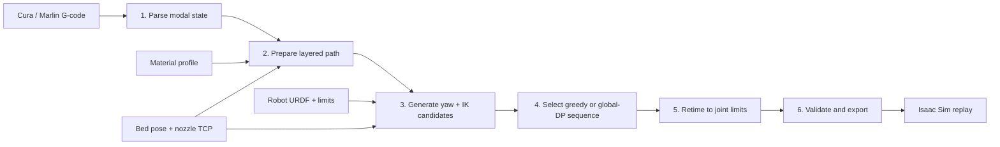

<div align="center">

# Robotic Printing Platform

### G-code to validated robot trajectories and Isaac Sim deposition replay

[](https://github.com/ZehaoDang1127/Robot-Arm-3D-Printing/actions/workflows/tests.yml)


This repository turns Cura/Marlin G-code into a material-aware Cartesian path,
maps that path onto a URDF robot with inverse kinematics, retimes and validates
the joint trajectory, and exports a replay bundle for NVIDIA Isaac Sim.

</div>

---

## Pipeline overview

The platform treats sliced G-code as manufacturing intent, then progressively
adds the information needed by a robot and simulator. Each stage has a narrow
input/output contract, so parsing, path preparation, robot planning, timing,
validation, and replay can be tested or replaced independently.



| Stage | Input → output | Main implementation |
| --- | --- | --- |
| 1. Parse | G-code text → `ParseResult` / absolute `Move` records | `robotic_printing_platform/gcode/parser.py` |
| 2. Prepare | `ParseResult` → robot-frame `PathPrep` / `Waypoint` records | `robotic_printing_platform/path_planning/layered.py` |
| 3–4. Solve | `PathPrep` → `RobotTrajectory` with joint positions and IK diagnostics | `robotic_printing_platform/robots/generic.py` |
| 5. Retime | geometric joint path → timestamped velocity/acceleration-limited path | `robotic_printing_platform/trajectory/retiming.py` |
| 6. Validate/export | retimed path → reports, CSV/JSON, plots, and replay script | `robotic_printing_platform/validation/`, `exporters/isaac.py` |
| Replay | exported trajectory + measured simulated TCP → deposited material | `robotic_printing_platform/extrusion/deposition.py` |

The default implementation is planar: it places the sliced part on a horizontal
bed and constrains the nozzle axis to point down. Nozzle spin about that axis is
left free, providing a process redundancy that the greedy or dynamic-programming
selector can exploit.

## Replay showcase

<div align="center">
  <a href="./Robotic_3D%20Printing_demo.mp4">
    
  </a>
  <br>
  <sub><a href="./Robotic_3D%20Printing_demo.mp4">Watch the full replay</a></sub>
</div>

The recorded example uses the included wall-hook G-code, the complete first
parsed layer, the `ur5e` package, the repository-local mounted-extruder USD,
2 mm waypoint spacing, no simplification, and greedy candidate selection.

## Quick start

### Install

Python 3.10 or newer is required. NumPy is the only normal runtime dependency;
Isaac Sim is optional and installed separately.

```bash
git clone https://github.com/ZehaoDang1127/Robot-Arm-3D-Printing.git
cd Robot-Arm-3D-Printing
python -m venv .venv
```

Windows PowerShell:

```powershell
.\.venv\Scripts\Activate.ps1
python -m pip install -r requirements.txt
```

Linux or macOS:

```bash
source .venv/bin/activate
python -m pip install -r requirements.txt
```

### Preview parsing and path preparation

This skips IK and is the fastest way to check layers, print/travel
classification, bed placement, extrusion conversion, and waypoint density:

```bash
python run_pipeline.py strong_universal_wall_hook_vcd.gcode \
  --material alginate_chitosan_pic_al1ch1_research \
  --lo 0 --hi 1 \
  --skip-ik \
  --output-dir outputs/preview
```

The included `_vcd.gcode` sample uses volumetric `E` values and therefore
matches the volumetric research profile above. Use `--material pla` for normal
filament-length G-code.

### Run a short IK smoke test

Coarse spacing and a waypoint cap make this suitable for checking an
installation rather than estimating print time:

```bash
python run_pipeline.py strong_universal_wall_hook_vcd.gcode \
  --material alginate_chitosan_pic_al1ch1_research \
  --robot ur5e \
  --lo 0 --hi 1 \
  --max-seg-len-mm 20 \
  --simplify-deg 2 \
  --max-ik-waypoints 30 \
  --output-dir outputs/smoke
```

`--ik-stride` and `--max-ik-waypoints` deliberately sample or truncate the
path. Reports produced with either option mark timing as preview-only.

### Generate the complete UR5e replay bundle

```bash
python run_pipeline.py strong_universal_wall_hook_vcd.gcode \
  --material alginate_chitosan_pic_al1ch1_research \
  --robot ur5e \
  --isaac-usd UR5e_extruder.usd \
  --lo 0 --hi 1 \
  --max-seg-len-mm 2 \
  --simplify-deg 0 \
  --ik-selection-mode greedy \
  --output-dir outputs
```

Do not add a waypoint cap to a printing-quality export. Launch the generated
script with Isaac Sim's Python:

```powershell
& '<ISAAC_SIM_ROOT>\python.bat' '<REPOSITORY_ROOT>\outputs\ur5e\replay_isaac.py'
```

## How the pipeline works

### 1. Modal G-code parsing

The parser is a small state machine rather than a line-by-line coordinate
reader. It resolves:

- `G90` / `G91`: absolute or relative Cartesian positioning;
- `M82` / `M83`: absolute or relative extrusion;
- `G20` / `G21`: inch or millimetre units;
- `G92`: coordinate or extruder resets without motion;
- `G28`: homing; and
- Cura `;LAYER:n` metadata, with Z-based layer inference as a fallback.

Every `G0` or `G1` becomes an absolute target `Move`. The parser retains the
modal feedrate, raw extruder position `e`, per-move extrusion delta `de`, layer,
and rapid flag. A move is classified as printing only when `de > 0`; travel,
retraction, wipe, and Z-hop moves remain non-printing. Coordinates stay in the
printer frame and in millimetres at this stage.

This separation matters: downstream code uses `ParseResult.iter_segments()`
as the single source of truth for what the slicer requested, while all robot
placement and resampling happens later.

### 2. Layered path preparation

`LayeredPathPlanner` converts selected source layers into `Waypoint` objects:

1. Consecutive moves are grouped into print or travel runs. Each run receives
   a `seg_id`, which later defines continuity boundaries for DP and yaw metrics.
2. Near-collinear print vertices are removed only when adjacent feedrates are
   equal. Their extrusion is carried forward, so simplification cannot erase
   material or a speed change.
3. Segments longer than `max_seg_len_mm` are subdivided. Extrusion is split
   evenly across the inserted segments; zero-length prime moves are preserved
   as dwell waypoints.
4. The arithmetic mean of the selected run vertices is subtracted from XY;
   coordinates are then converted from millimetres to metres and translated by
   `T_base_bed` to the configured bed center.
5. The material profile converts each positive `de` to volume and, when
   density is available, mass.
6. The default planar pose assigns the nozzle axis `[0, 0, -1]` and marks yaw
   as free.

The planner compares total positive source extrusion with total waypoint
extrusion and fails if simplification or densification did not conserve it.

Material conversion depends on `extrusion_mode`:

| Mode | Meaning of one G-code `E` unit | Volume calculation |
| --- | --- | --- |
| `filament_length` | 1 mm of feedstock filament | `E × π(d/2)² × flow_multiplier` |
| `volumetric` | 1 mm³ of deposited material | `E × flow_multiplier` |
| `syringe_plunger` | 1 mm of plunger travel | `E × π(d_s/2)² × flow_multiplier` |

### 3. URDF forward kinematics and inverse kinematics

Robot packages provide a serial-chain URDF, ordered planning joints, limits,
home pose, end link, nozzle TCP, and simulator asset. The dependency-light URDF
loader supports fixed, revolute, continuous, and prismatic joints. Forward
kinematics composes each joint origin and motion transform, then applies the
configured end-link-to-nozzle transform.

For a target pose, IK iterates on a six-dimensional position/orientation error.
With a weighted geometric Jacobian `J`, damping `λ`, and error vector `e`, the
task update is damped least squares:

```text
dq_task = Jᵀ (J Jᵀ + λ² I)⁻¹ e
```

A home-pose bias is projected into the damped Jacobian nullspace:

```text
dq = dq_task + w_null (I - J⁺J) (q_home - q)
```

Projecting the bias is important for six-axis arms: it avoids directly pulling
the joints away from the Cartesian task. Every iteration caps the largest
joint update and clamps the result to joint limits. A candidate succeeds only
when both position and rotation residuals meet their configured tolerances. If
the iteration budget is exhausted, the best iterate is retained, exported, and
reported as outside tolerance instead of disappearing from the path.

For every accepted joint vector the pipeline also computes Yoshikawa
manipulability (the product of Jacobian singular values) and the smallest
singular value `σ_min`. These values support singularity reporting and the DP
candidate cost.

### 4. Yaw candidates: greedy vs. global dynamic programming

Greedy and `global_dp` use the same URDF model and damped least-squares solver.
The difference is sequence selection.

For a yaw-free waypoint, the planner samples `yaw_samples` angles uniformly
over `[-π, π)`, ordered to try small absolute yaw first. Each yaw produces an
IK candidate with joint vector `q`, residuals, convergence status, iteration
count, and a unary cost:

```text
U = w_error (position_error + w_orientation × rotation_error)
    + 10 × [IK failed]
    + w_singularity / (σ_min + ε)
    + w_collision × collision_warning_count
```

The collision term is disabled by default (`global_dp_collision_penalty = 0`).
Collision checks are coarse warnings, not constraints.

#### Greedy selection

At waypoint `i`, greedy selection chooses:

```text
arg min_k  U_i(k) + ||q_i(k) - q_previous||₂
```

The selected joints seed the next waypoint. This makes greedy planning fast,
streaming-friendly, and usually continuous, but the choice cannot be revised
when a later waypoint reveals that another yaw branch would have been better.

#### Global-DP selection

For each contiguous print run, DP first builds all yaw/IK candidate layers.
Candidate generation still advances a reference seed to improve numerical
convergence, but final selection is performed over the entire run. Travel
waypoints remain greedy, and DP restarts at the next print run.

The DP state stores two adjacent candidates, which makes the objective
second-order. With feedrate-derived segment duration `Δt_i`:

```text
v_i = (q_i - q_{i-1}) / Δt_i

cost = Σ U_i
     + w_motion Σ ||v_i||²
     + w_smoothness Σ ||v_i - v_{i-1}||²
```

Backtracking recovers the minimum-cost candidate sequence. Because the state
remembers the previous joint velocity, `global_dp` can avoid a locally cheap
yaw that would cause a large later joint move or abrupt velocity change.

| Property | `greedy` | `global_dp` |
| --- | --- | --- |
| Selection horizon | Current waypoint | Complete contiguous print run |
| Joint continuity term | Distance from previous `q` | Squared velocity and velocity-change costs |
| Can revise an earlier yaw choice? | No | Yes, within the current print run |
| Travel moves | Greedy | Greedy |
| Candidate IK solves | Up to `yaw_samples` per waypoint | Same candidate count |
| Selection cost | Approximately linear in waypoints × candidates | Second-order DP; roughly `O(NK³)` for `N` waypoints and `K` candidates |
| Best use | Default runs, long paths, rapid iteration | Research comparisons and runs where branch smoothness justifies extra compute |

DP optimizes its configured objective; it is not guaranteed to improve every
reported metric or final print time. Compare success rate, joint motion, yaw
discontinuities, residuals, singularity margin, warnings, and retimed duration.

### 5. Trajectory retiming

IK produces geometry, not executable timing. For every segment, retiming starts
with the largest of:

```text
Cartesian duration = ||p_i - p_{i-1}|| / feed_i
velocity duration  = max_j |q_i,j - q_{i-1,j}| / velocity_limit_j
minimum duration   = 1 microsecond
```

Forward and backward passes then enlarge adjacent segment durations until
centered finite-difference accelerations satisfy every joint acceleration
limit. Endpoint terms enforce zero starting and ending velocity. Timing is
only stretched—never shortened below the G-code feed duration—so joint limits
cannot make the robot run faster than the requested Cartesian feed.

### 6. Validation, collision warnings, and export

Validation reports:

- IK success rate and position/rotation residual statistics;
- total joint motion, maximum joint step, velocity, and acceleration;
- velocity/acceleration violation counts and minimum joint-limit margin;
- minimum manipulability and `σ_min`, plus near-singular waypoint indices;
- yaw discontinuities, estimated duration, and deposited volume; and
- collision and reach warnings.

Collision checking approximates links as capsules, the bed as an axis-aligned
box, and completed lower layers as a growing axis-aligned volume. It checks bed
clearance, non-adjacent self-collision, and tool clearance from earlier layers.
The result is a non-blocking warning heuristic, not continuous collision
detection or a safety certificate.

## Configuration and robot packages

`planner_config.json` contains workcell and algorithm settings. A robot folder
contains the model-specific URDF and limits; robot values override shared TCP
or IK defaults where needed.

| Configuration block | Controls |
| --- | --- |
| `robot.config_dir` | Package used by `--robot config` |
| `bed` | Base-frame center, footprint, thickness, clearance, and a nominal normal reserved for planner extensions |
| `nozzle_tcp` | End-link-to-nozzle translation and roll/pitch/yaw |
| `material` | Active profile ID and profile directory |
| `path_preparation` | Maximum segment length and simplification tolerance |
| `ik` | Residual tolerances, DLS settings, yaw sampling, selector mode/weights, stride, and cap |

Bundled packages:

| CLI name | Model | DoF | Notes |
| --- | --- | ---: | --- |
| `panda` | Franka Emika Panda | 7 | Default CLI package; redundant serial arm |
| `ur5` | Universal Robots UR5 | 6 | Bundled URDF and Isaac asset path |
| `ur5e` | Universal Robots UR5e + extruder | 6 | Mounted-extruder USD, CAD-derived nozzle TCP, 2 mm position tolerance override |
| `both` | Panda and UR5 | — | Plans the same prepared path for both packages |
| `config` | Config-selected robot | — | Loads `robot.config_dir` from the planner JSON |

Useful experiment settings:

```json
{
  "ik": {
    "yaw_samples": 5,
    "ik_selection_mode": "greedy",
    "global_dp_motion_weight": 10.0,
    "global_dp_smoothness_weight": 0.15,
    "global_dp_ik_error_weight": 25.0,
    "global_dp_singularity_weight": 0.01,
    "global_dp_collision_penalty": 0.0
  }
}
```

CLI flags override the settings most often changed during a run. Use
`python run_pipeline.py --help` for the full interface.

### Position-tolerance sweep

To measure convergence as the position tolerance tightens:

```bash
python run_pipeline.py strong_universal_wall_hook_vcd.gcode \
  --material alginate_chitosan_pic_al1ch1_research \
  --robot ur5e --lo 0 --hi 1 \
  --max-ik-waypoints 100 \
  --position-tolerance-sweep-mm 8 5 3 2 1 \
  --output-dir outputs/tolerance_sweep
```

## Output bundle

Each selected robot gets a subdirectory under `--output-dir`. Re-running an
export replaces that robot's current bundle, so use separate output roots for
comparisons or archived experiments.

| Artifact | Contents |
| --- | --- |
| `gcode_path.svg` | Source-frame print and travel path |
| `robot_waypoints.svg`, `robot_waypoints_xz.svg` | Base-frame Cartesian path |
| `joint_trajectory.svg` | Joint positions over the retimed path |
| `robot_print_trajectory.csv` | Flat timing, pose, joints, derivatives, extrusion, and IK diagnostics |
| `robot_print_trajectory.json` | Structured trajectory and IK summary |
| `resolved_material_profile.json` | Exact material/process profile used for the export |
| `trajectory_validation_report.json` | Kinematic, timing, singularity, collision, and volume metrics |
| `ik_tolerance_sweep.json` | Optional tolerance-sweep results |
| `replay_isaac.py` | Generated Isaac Sim entry point |

The committed UR5e first-layer reference bundle reports:

| Metric | Result |
| --- | ---: |
| Waypoints / IK success | 13,099 / 100% |
| Maximum position error | 1.99999 mm |
| Total joint motion | 40.7425 rad |
| Yaw discontinuities | 0 |
| Velocity / acceleration violations | 0 / 0 |
| Collision warnings | 0 |
| Retimed duration | 602.50 s |
| Deposited volume | 2,526.91 mm³ |

These numbers describe one software configuration and asset revision, not a
physical calibration or safety analysis.

## Isaac Sim replay and deposition

The exporter keeps Isaac Sim out of the core Python dependency set. The
generated script loads the selected USD, maps the trajectory's joint names to
the articulation, initializes the first pose, and interpolates position targets
against the retimed trajectory clock.

Deposition follows the measured simulated TCP, not the planned Cartesian
waypoint. A piecewise flow schedule divides each printing segment's resolved
volume by its retimed duration. On every physics step, `DepositionManager`:

1. splits the elapsed interval at flow boundaries;
2. integrates the exact scheduled volume;
3. interpolates the TCP pose for each slice;
4. emits material along the measured TCP chord, or a droplet for stationary
   extrusion; and
5. refreshes the anchor during travel so a later print does not bridge empty
   space.

Large TCP jumps or rotations break continuity instead of drawing across a
simulation teleport.

Replay modes:

| Mode | Implementation | Use |
| --- | --- | --- |
| `particles` | One shared GPU PhysX PBD particle set with material coefficients from the resolved profile | Material interaction, gravity, adhesion, and bed collision |
| `visual` + `mesh` | Volume-consistent elliptical tube meshes and ellipsoidal droplets | Default lightweight visual preview; supports anisotropic spreading/shrinkage |
| `visual` + `curve` | Batched circular curves and spherical droplets | Faster preview for very long paths |

Common replay environment variables:

| Variable | Purpose |
| --- | --- |
| `RPP_DEPOSITION_MODE=particles|visual` | Select physical particles or geometric preview |
| `RPP_VISUAL_BEAD_GEOMETRY=mesh|curve` | Choose visual backend |
| `RPP_POST_DEPOSITION_TIME_S` | Keep the replay running to observe settling/evolution |
| `RPP_MAX_TCP_STEP_M` | Break deposition across larger measured TCP jumps |
| `RPP_ROBOT_USD`, `RPP_TRAJECTORY_CSV` | Override exported asset or trajectory |
| `RPP_PROJECT_ROOT` | Locate the clone when the replay lives outside it |
| `RPP_MOUNT_SCALE`, `RPP_MOUNT_MASS_KG` | Override mounted-tool scale or measured payload mass |
| `RPP_ENABLE_MOUNT_COLLISION=1` | Opt into mount collision |
| `RPP_PARTICLE_ISOSURFACE=1` | Enable the optional render-only particle surface |

The replay additionally writes `joint_tracking.csv`,
`joint_tracking_summary.json`, and `joint_tracking.svg`. Deposited material
still follows the measured TCP when desired-versus-actual tracking error is
nonzero.

## Extending the platform

### Add a robot

Copy a folder under `robotic_printing_platform/robots/robot_configs/`, replace
`robot.urdf`, and edit `robot_config.json` with the link names, ordered joints,
home pose, limits, reach, simulator asset, and optional TCP/IK overrides. A
conventional serial chain can use `URDFRobotPlanner` without a new solver class.

### Add a path-planning strategy

Implement `PathPlanningAlgorithm.build()` and return a `PathPrep`-compatible
result. This is the extension point for alternate ordering, non-planar surface
normals, smoothing, workpiece placement, or deposition policies.

### Add a material/process model

Copy a JSON profile under `material_profiles/`, make `profile_id` match the
filename, and select it with `--material PROFILE_ID`. No exporter changes are
needed for the existing `filament_length`, `volumetric`, or `syringe_plunger`
conventions. The selected profile is copied into the output bundle so planning
and replay use identical values.

## Repository layout

```text
robotic-printing-platform/
|-- run_pipeline.py                     # end-to-end CLI
|-- planner_config.json                 # workcell and planning settings
|-- material_profiles/                  # material/process profiles
|-- robotic_printing_platform/
|   |-- gcode/                          # modal parser
|   |-- path_planning/                  # layered path preparation
|   |-- robots/                         # URDF kinematics, IK, candidate selection
|   |   `-- robot_configs/              # Panda, UR5, and UR5e packages
|   |-- trajectory/                     # retiming
|   |-- validation/                     # metrics and collision warnings
|   |-- extrusion/                      # material conversion and deposition
|   `-- exporters/                      # Isaac Sim bundle generation
|-- tests/                              # unit and end-to-end tests
|-- outputs/                            # generated/committed example bundles
|-- UR5e_extruder.usd                   # UR5e mounted-extruder assembly
`-- strong_universal_wall_hook_vcd.*    # sample model and volumetric G-code
```

## Tests

```bash
python -m unittest discover -s tests -t . -v
```

The suite covers modal parsing behavior through end-to-end use, extrusion
conservation, material profiles, layered metadata, generic robot packages,
damped IK and tolerance sweeps, greedy/global candidate selection, Jacobian
metrics, retiming, capsule collision warnings, export generation, TCP flow
integration, and visual bead geometry/evolution.

## Scope and safety

> [!IMPORTANT]
> This is a planning and simulation toolchain. It does not command physical
> hardware. Independently calibrate and validate the robot, base/bed frames,
> nozzle TCP, payload, collision geometry, process timing, controller, and
> safety system before any physical experiment.

Current limitations:

- only linear Cura/Marlin `G0` and `G1` moves are expanded;
- the default path planner is planar with a globally downward nozzle axis;
- collision results are sampled geometric warnings, not continuous proofs;
- the NumPy IK solver is for planning and simulation export, not certified
  real-time control; and
- PhysX PBD and visual beads do not model heat transfer, phase change, curing,
  chemical cross-linking, sterility, or biological performance.

## Parameter provenance

The included `alginate_chitosan_pic_al1ch1_research` profile is a transparent
research preset, not a validated clinical or quantitative rheology model. Its
Al1Ch1.0 composition and 400 μm nozzle basis come from Liu et al. [1]; density
uses an alginate-bioink proxy from Jia et al. [4]. The PhysX coefficients are
solver starting points or project heuristics and must be calibrated against
measured bead width, height, spreading, sag, and deposited mass. In particular,
PhysX `viscosity`, `cohesion`, and related fields are not SI rheology values.

Related experimental context and simulator references:

1. Q. Liu et al., [“Preparation and Properties of 3D Printed Alginate-Chitosan Polyion Complex Hydrogels for Tissue Engineering,” *Polymers* 10(6), 664 (2018)](https://doi.org/10.3390/polym10060664).
2. C. Gao et al., [“A Small-Molecule Polycationic Crosslinker Boosts Alginate-Based Bioinks for Extrusion Bioprinting,” *Advanced Functional Materials* 34(9), 2310369 (2024)](https://doi.org/10.1002/adfm.202310369).
3. C. Wang et al., [“A Programmable Handheld Extrusion-Based Bioprinting Platform for In Situ Skin Wounds Dressing,” *Advanced Science* 11(46), 2405823 (2024)](https://doi.org/10.1002/advs.202405823).
4. J. Jia et al., [“Engineering alginate as bioink for bioprinting,” *Acta Biomaterialia* 10(10), 4323–4331 (2014)](https://doi.org/10.1016/j.actbio.2014.06.034).
5. NVIDIA Omniverse PhysX, [Fluid Ball / Paint Ball Emitter demo](https://github.com/NVIDIA-Omniverse/PhysX/blob/main/omni/extensions/ux/source/omni.physx.demos/python/scenes/FluidBallEmitterDemo.py).
6. NVIDIA Omniverse, [PhysX particle simulation and offset documentation](https://docs.omniverse.nvidia.com/kit/docs/omni_physics/latest/dev_guide/particles/particles.html).
7. NVIDIA Omniverse, [PhysX PBD material API](https://docs.omniverse.nvidia.com/kit/docs/usdrt/latest/_apidocs/classusdrt_1_1PhysxSchemaPhysxPBDMaterialAPI.html).

Robot-specific source links are recorded beside each package in
`robotic_printing_platform/robots/robot_configs/*/robot_config.json`.
