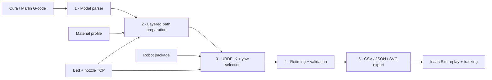

<div align="center">

# Robotic Printing Platform

### From slicer output to robot-aware additive-manufacturing trajectories

[](https://github.com/ZehaoDang1127/Robot-Arm-3D-Printing/actions/workflows/tests.yml)


Convert Cura/Marlin G-code into material-aware Cartesian waypoints, solve a
robot-specific joint trajectory, validate it, and export a self-contained
replay bundle for NVIDIA Isaac Sim.

</div>

---

## Highlights

- **End-to-end planning** — parse G-code, prepare the print path, solve URDF-based inverse kinematics, retime the trajectory, validate it, and export simulation artifacts from one CLI.
- **Slicer-faithful extrusion** — preserve each move's raw `E` state and extrusion delta while converting deposited filament into material volume and optional mass.
- **Robot-agnostic core** — use the included Franka Panda, UR5, and UR5e packages or add another serial manipulator through a URDF and a JSON configuration.
- **Redundancy-aware IK** — sample nozzle yaw and select solutions greedily or with a global dynamic-programming pass designed to reduce motion and discontinuities along print runs.
- **Built-in validation** — report IK residuals, joint-limit margin, velocity and acceleration violations, Jacobian quality, estimated print time, and lightweight collision warnings.
- **Simulation-ready output** — generate CSV/JSON trajectories, SVG diagnostics, an Isaac Sim replay, visual bead deposition, and desired-versus-actual joint-tracking logs.

## UR5e mounted-extruder replay showcase

<div align="center">
  <a href="./Robotic_3D%20Printing_demo.mp4">
    
  </a>
  <br>
  <sub><a href="./Robotic_3D%20Printing_demo.mp4">Watch the full 77-second replay</a></sub>
</div>

The recording demonstrates the complete, uncapped first-layer replay generated
by the [UR5e command below](#4-generate-the-ur5e-mounted-extruder-replay), not
the coarse smoke-test configuration:

| Replay setting | Recorded configuration |
| --- | --- |
| Input and layer range | `strong_universal_wall_hook_vcd.gcode`, `--lo 0 --hi 1` (the complete first parsed layer) |
| Robot and tool asset | `--robot ur5e` with `--isaac-usd UR5e_extruder.usd`, including the repository-local mounted-extruder payload and UR5e nozzle TCP |
| Path preparation | `--max-seg-len-mm 2` and `--simplify-deg 0` |
| IK selection and coverage | `--ik-selection-mode greedy`, full waypoint coverage, and no `--max-ik-waypoints` cap |
| Replay output | Retimed position-target playback in Isaac Sim with orange visual bead deposition for printing moves |

## What is the Robotic Printing Platform?

Conventional slicers describe how a Cartesian 3D printer should move; they do
not account for the kinematics, redundancy, limits, singularities, or geometry
of a multi-axis robot arm. This project bridges that gap. It treats the G-code
as the manufacturing intent, preserves its layer, feedrate, travel, retraction,
and extrusion semantics, then translates the selected print layers into a
robot-base-frame trajectory suitable for analysis and simulation.

The repository is organized as a set of replaceable stages rather than a
single robot-specific script. The G-code parser, material model, path planner,
robot solver, trajectory retimer, validation tools, and simulator exporter
have explicit boundaries, making the platform useful both as a working UR5e
printing pipeline and as a foundation for research on robot-aware additive
manufacturing.

> [!IMPORTANT]
> This is a planning and simulation toolchain. It does not command physical
> hardware. Before a real print, independently calibrate the robot model, base
> and bed frames, nozzle TCP, payload, collision geometry, process timing, and
> safety system in the production control stack.

## Pipeline at a glance



| Stage | What it does | Key result |
| --- | --- | --- |
| Parse | Resolves modal motion and extrusion state from `G0`/`G1`, `G20`/`G21`, `G90`/`G91`, `M82`/`M83`, `G92`, and Cura layer comments. | Absolute printer-frame moves with per-move `de`, feedrate, layer, print/travel state, and bounds. |
| Prepare | Groups contiguous print and travel runs, simplifies collinear print vertices, densifies long segments, conserves extrusion, and places the part on the configured bed. | Material-aware Cartesian waypoints in metres with a downward planar nozzle axis. |
| Solve | Loads a serial chain from URDF, runs damped least-squares IK over candidate nozzle yaws, and applies greedy or global selection. | Joint positions, residuals, IK iterations, and Jacobian metrics for each waypoint. |
| Retime | Starts from the G-code feedrate and increases segment duration as needed to satisfy configured joint velocity and acceleration limits. | A timestamped trajectory that starts and ends at zero joint velocity. |
| Validate and export | Evaluates trajectory quality and writes simulator/runtime artifacts. | Machine-readable reports, plots, trajectory files, and an Isaac Sim replay script. |

## Supported robot packages

All bundled robots use the same `URDFRobotPlanner`; their geometry, joint
metadata, limits, home pose, simulator asset, TCP, and IK overrides live in
their own configuration folders.

| CLI name | Model | DoF | Notes |
| --- | --- | ---: | --- |
| `panda` | Franka Emika Panda | 7 | Default package; bundled URDF and 855 mm configured reach. |
| `ur5` | Universal Robots UR5 | 6 | Bundled URDF, UR-style joint chain, and Isaac Sim UR5 asset path. |
| `ur5e` | Universal Robots UR5e + extruder | 6 | NVIDIA/UR-aligned geometry, custom mounted-extruder USD, CAD-derived nozzle TCP, and a 2 mm position tolerance override. |
| `both` | Panda + UR5 | — | Runs the same prepared path for both packages and separates their outputs. |
| `config` | User-selected package | — | Uses `robot.config_dir` from the supplied planner configuration. |

## Quick start

### 1. Install

Python 3.10 or newer is required. NumPy is the only Python runtime dependency.

```bash
git clone https://github.com/ZehaoDang1127/Robot-Arm-3D-Printing.git
cd Robot-Arm-3D-Printing
python -m venv .venv
```

Activate the environment on Windows:

```powershell
.\.venv\Scripts\Activate.ps1
python -m pip install -r requirements.txt
```

Or on Linux/macOS:

```bash
source .venv/bin/activate
python -m pip install -r requirements.txt
```

NVIDIA Isaac Sim is optional and is installed separately. It is only required
to execute a generated replay, not to parse, plan, validate, or export a path.

### 2. Preview the sample print

Parse and prepare the first layer without running IK:

```bash
python run_pipeline.py strong_universal_wall_hook_vcd.gcode \
  --lo 0 --hi 1 \
  --skip-ik \
  --output-dir outputs/preview
```

This is the fastest way to inspect the source path, bed placement, print/travel
classification, and waypoint density.

### 3. Run an IK/export smoke test

Use coarse spacing and a waypoint cap for a quick Panda check:

```bash
python run_pipeline.py strong_universal_wall_hook_vcd.gcode \
  --robot panda \
  --lo 0 --hi 1 \
  --max-seg-len-mm 20 \
  --simplify-deg 2 \
  --max-ik-waypoints 30 \
  --output-dir outputs/smoke
```

Run the same path against Panda and UR5:

```bash
python run_pipeline.py strong_universal_wall_hook_vcd.gcode \
  --robot both \
  --lo 0 --hi 1 \
  --max-seg-len-mm 20 \
  --simplify-deg 2 \
  --max-ik-waypoints 30 \
  --output-dir outputs/compare
```

### 4. Generate the UR5e mounted-extruder replay

The following command solves the complete first layer with the UR5e package,
the repository-local mounted-extruder asset, 2 mm maximum waypoint spacing,
and no path simplification:

```bash
python run_pipeline.py strong_universal_wall_hook_vcd.gcode \
  --robot ur5e \
  --isaac-usd UR5e_extruder.usd \
  --lo 0 --hi 1 \
  --max-seg-len-mm 2 \
  --simplify-deg 0 \
  --ik-selection-mode greedy \
  --output-dir outputs/ur5e_extruder
```

Do not add `--max-ik-waypoints` to a printing-quality export: that option is a
deliberate sampling cap for fast smoke tests.

Launch the generated script with Isaac Sim's Python on Windows:

```powershell
& '<ISAAC_SIM_ROOT>\python.bat' '<REPOSITORY_ROOT>\outputs\ur5e_extruder\ur5e\replay_isaac.py'
```

The replay resolves the trajectory CSV and custom USD relative to its own
location, so the output and repository assets can be moved together without
embedding machine-specific paths.

## Reference UR5e result

The full first-layer configuration above has been validated with the included
wall-hook G-code and mounted-extruder model:

| Metric | Result |
| --- | ---: |
| Total waypoints | 13,099 |
| Printing waypoints | 11,177 |
| IK success | 100% |
| Maximum Cartesian position error | 1.99999 mm |
| Joint velocity violations | 0 |
| Joint acceleration violations | 0 |
| Collision warnings | 0 |
| Retimed trajectory duration | 602.5 s |
| Estimated deposited volume | 2,526.91 mm³ |

These figures validate one software configuration and asset revision; they are
not a substitute for physical calibration or an independent safety analysis.

## Common workflows

Process every layer without IK:

```bash
python run_pipeline.py strong_universal_wall_hook_vcd.gcode \
  --all-layers \
  --skip-ik \
  --output-dir outputs/all_layers
```

Create a coarse all-layer IK preview while retaining coverage of the complete
path:

```bash
python run_pipeline.py strong_universal_wall_hook_vcd.gcode \
  --all-layers \
  --ik-stride 5000 \
  --max-seg-len-mm 20 \
  --simplify-deg 2 \
  --output-dir outputs/all_layers_preview
```

Compare local greedy yaw selection with global dynamic programming:

```bash
python run_pipeline.py strong_universal_wall_hook_vcd.gcode \
  --robot ur5e \
  --lo 0 --hi 1 \
  --ik-selection-mode global_dp \
  --max-ik-waypoints 100 \
  --output-dir outputs/global_dp_preview
```

Measure IK convergence as the position tolerance tightens:

```bash
python run_pipeline.py strong_universal_wall_hook_vcd.gcode \
  --robot ur5e \
  --lo 0 --hi 1 \
  --max-ik-waypoints 100 \
  --position-tolerance-sweep-mm 8 5 3 2 1 \
  --output-dir outputs/tolerance_sweep
```

Analyze a robot package directly with FK, workspace sampling, and IK:

```bash
python analyze_urdf_ik.py \
  --robot-config-dir robotic_printing_platform/robots/robot_configs/franka_panda \
  --samples 500 \
  --target 0.45 0.0 0.25
```

Run `python run_pipeline.py --help` for the complete CLI reference.

## Configuration

`planner_config.json` separates the workcell and process settings from the
robot package. CLI options can override the settings most useful during an
experiment without changing the file.

| Section | Controls |
| --- | --- |
| `robot.config_dir` | Robot package selected when `--robot config` is used. |
| `bed` | Bed center in the robot base frame, normal, footprint, thickness, and minimum clearance. |
| `nozzle_tcp` | Flange-to-nozzle translation and roll/pitch/yaw. A robot package can override these values. |
| `material` | Material name, filament diameter, flow multiplier, and optional density. |
| `path_preparation` | Maximum Cartesian segment length and collinear simplification tolerance. |
| `ik` | Residual tolerances, iteration budget, damping, yaw sampling, local/global selection weights, stride, and waypoint cap. |

### Change the material model

```json
{
  "material": {
    "name": "PLA",
    "filament_diameter_mm": 1.75,
    "flow_multiplier": 1.0,
    "density_g_cm3": 1.24
  }
}
```

The parser keeps raw extrusion as `Move.e`, `Move.de`, and `Move.has_e`. During
path preparation, each positive `de` is converted into
`extrusion_volume_mm3` and, when density is configured, `extrusion_mass_g`.
Simplification and densification redistribute extrusion across new waypoints
and fail fast if the total deposited filament is not conserved.

### Place the print bed

The selected path is recentered in printer XY, converted from millimetres to
metres, and translated by `bed.center_xyz_m`. For quick experiments, the bed
center can be overridden from the CLI:

```bash
python run_pipeline.py model.gcode \
  --bed-x-m 0.45 --bed-y-m 0.0 --bed-z-m 0.10 \
  --skip-ik
```

The current `LayeredPathPlanner` targets planar printing with the nozzle axis
pointing down in the robot base frame. The bed normal and non-planar tilt hooks
are configuration/extension points; arbitrary non-planar surface following is
not implemented by the default planner.

## Outputs

The pipeline writes one subdirectory per selected robot beneath
`--output-dir`.

| Artifact | Description |
| --- | --- |
| `gcode_path.svg` | Top view of parsed print and travel moves in the source printer frame. |
| `robot_waypoints.svg` | Top view after transforming the path into the robot base frame. |
| `robot_waypoints_xz.svg` | Side view of base-frame Cartesian waypoints. |
| `joint_trajectory.svg` | Joint position plot for the solved trajectory. |
| `robot_print_trajectory.csv` | Flat trajectory with time, joints, derivatives, pose, layer, segment, extrusion, IK residual, iteration, and Jacobian fields. |
| `robot_print_trajectory.json` | Structured form of the same trajectory and its IK summary. |
| `trajectory_validation_report.json` | IK, timing, limits, singularity, collision-warning, and deposited-volume metrics. |
| `ik_tolerance_sweep.json` | Convergence results when `--position-tolerance-sweep-mm` is requested. |
| `replay_isaac.py` | Standalone Isaac Sim replay with time interpolation and PhysX PBD material extrusion. |

When an Isaac replay runs, it additionally writes:

| Runtime artifact | Description |
| --- | --- |
| `joint_tracking.csv` | Timestamped desired and measured joint positions and errors. |
| `joint_tracking_summary.json` | Maximum/RMS tracking error, thresholds, pass/fail state, and skipped deposition count. |
| `joint_tracking.svg` | Dependency-free desired-versus-actual tracking plot. |

## Isaac Sim replay

The exporter generates a replay rather than depending on Isaac Sim from the
main Python environment. The script loads the selected USD, initializes the
robot at the first trajectory pose, waits for the articulation to settle, and
then interpolates joint targets against the retimed trajectory clock.

For custom Robot Assembler assets, the replay can select a `Physics=PhysX`
variant and add a missing articulation-root marker in memory. The source USD is
not modified. The repository's `UR5e_extruder.usd` also references
`Mount_Extruder_Models/ur5_mount_extruder.usd`; keep that payload in its
repository-relative location when moving the project.

The supplied mount CAD uses 0.1 mm authored units. Replay detects the resulting
ten-times overscale and corrects its maximum dimension from approximately
1.48 m to 0.148 m before physics begins. Mount collision is off by default for
trajectory/deposition visualization, and an explicit positive payload mass is
recommended for calibrated dynamics.

| Environment variable | Purpose |
| --- | --- |
| `RPP_ROBOT_USD` | Override the robot or assembly asset used by replay. |
| `RPP_TRAJECTORY_CSV` | Override the trajectory CSV used by replay. |
| `RPP_MOUNT_SCALE` | Explicit positive uniform scale for a different mount revision. |
| `RPP_MOUNT_MASS_KG` | Measured positive mass of the complete mount/extruder payload. |
| `RPP_ENABLE_MOUNT_COLLISION=1` | Enable mount collision when physical tool contact is intentionally under test. |
| `RPP_DEPOSITION_MODE=particles` | PhysX PBD extrusion (default); use `visual` for the previous curve-only preview. |
| `RPP_MAX_DEPOSITION_PARTICLES` | Maximum particles in the shared particle set; default `250000`. |
| `RPP_PARTICLE_ISOSURFACE=1` | Render the physical particles as a continuous surface; disable to inspect/debug particles. |

Physical deposition is enabled by default. The generated replay creates a GPU
PhysX PBD particle system, a viscous/cohesive/adhesive material, and a static
collider at the configured print-bed pose. Extruded volume is converted to a
particle count with a carried fractional remainder, so discretization does not
systematically lose material between trajectory rows. New material is appended
to one shared particle set, and smoothing plus an isosurface make the simulated
particles render as a continuous bead.

The starting PBD parameters live under `material` in `planner_config.json`:
`physx_particle_contact_offset_m`, `physx_viscosity`, `physx_cohesion`,
`physx_adhesion`, `physx_surface_tension`, `physx_friction`, and
`physx_damping`. Density is converted from `density_g_cm3` to SI units. These
parameters must be calibrated against measured bead width, height, spreading,
and sag for a particular material and nozzle. A smaller contact offset increases
resolution and particle count rapidly.

This model provides material mass, gravity, particle-particle interaction,
adhesion, and collision with the print bed. PhysX PBD does not model nozzle
temperature, heat transfer, crystallization, curing chemistry, or a true
molten-to-solid phase transition. Use `RPP_DEPOSITION_MODE=visual` when a fast
trajectory preview is more important than material physics. Deposition is
skipped when joint error exceeds 0.05 rad. Replay passes its tracking check only
when maximum error is at most 0.05 rad and RMS error is at most 0.02 rad.

## Repository layout

```text
Robot-Arm-3D-Printing/
├── run_pipeline.py                    # end-to-end CLI
├── analyze_urdf_ik.py                 # direct FK/workspace/IK analysis
├── visualize_pipeline.py              # dependency-free SVG diagnostics
├── planner_config.json                # workcell, material, path, and IK settings
├── requirements.txt                   # NumPy runtime dependency
├── UR5e_extruder.usd                  # UR5e + mounted-extruder assembly
├── Mount_Extruder_Models/             # mount USD/USDZ/STL payloads
├── strong_universal_wall_hook_vcd.*   # included STL and sliced G-code example
├── robotic_printing_platform/
│   ├── config.py                      # validated configuration loading
│   ├── gcode/                         # modal Cura/Marlin parser
│   ├── extrusion/                     # material and extrusion conversion
│   ├── path_planning/                 # planning interface + layered planner
│   ├── robots/                        # generic solver and robot packages
│   │   └── robot_configs/
│   │       ├── franka_panda/
│   │       ├── ur5/
│   │       └── ur5e/
│   ├── trajectory/                    # velocity/acceleration-aware retiming
│   ├── validation/                    # quality, collision, and sweep reports
│   └── exporters/                     # Isaac Sim bundle generation
└── test_*.py                          # unit and end-to-end smoke tests
```

## Extending the platform

### Add a robot

Copy a package under
`robotic_printing_platform/robots/robot_configs/`, replace `robot.urdf`, and
edit `robot_config.json` with the model's link names, ordered planning joints,
home pose, limits, reach, simulator asset, and any TCP or IK overrides. Point
`planner_config.json -> robot.config_dir` at the new folder and run with
`--robot config`.

For a conventional serial URDF chain, no new solver class is required:

```python
from robotic_printing_platform.robots.generic import URDFIKConfig, URDFRobotPlanner
```

Implement `RobotPlanner` only when the robot requires a fundamentally different
planning backend or trajectory contract.

### Add a path-planning strategy

Implement
`robotic_printing_platform.path_planning.base.PathPlanningAlgorithm` and return
a `PathPrep`-compatible result. A custom planner can change ordering,
smoothing, non-planar normal assignment, deposition policy, or workpiece
placement without modifying parsing, IK, validation, or export.

### Add a process/material model

`MaterialProfile` is intentionally small and replaceable. The default model
interprets `E` as filament length and derives volume from filament cross-section
and flow multiplier. Pellet extrusion, paste deposition, or syringe processes
can provide a different conversion while retaining the waypoint/export schema.

## Validation and tests

Run the complete test suite from the repository root:

```bash
python -m unittest discover -v
```

The tests cover layered metadata and extrusion conservation, generic robot
configuration, global yaw/IK selection, trajectory retiming, tolerance sweeps,
Jacobian manipulability, capsule collision warnings, Isaac replay generation,
and an end-to-end G-code smoke export for all bundled robot packages.

## Current scope and limitations

- The parser targets linear Cura/Marlin-style `G0` and `G1` motion. Arc and spline commands are not expanded.
- The default path planner is planar and assigns a globally downward nozzle axis.
- Collision checks use capsule and axis-aligned-box approximations and produce non-blocking warnings; they are not continuous collision proofs.
- The NumPy IK solver is intended for planning, experimentation, and simulation export, not certified real-time robot control.
- Isaac deposition uses a calibrated PBD approximation; it is not a thermo-mechanical phase-change simulation.
- Results depend on the accuracy of the URDF, bed transform, nozzle TCP, payload, and simulator asset.

## Acknowledgements

The platform builds on standard Cura/Marlin G-code conventions, URDF robot
descriptions, NumPy numerical methods, and NVIDIA Isaac Sim. Robot-specific
parameter sources and upstream model references are recorded alongside each
package under `robotic_printing_platform/robots/robot_configs/`.
